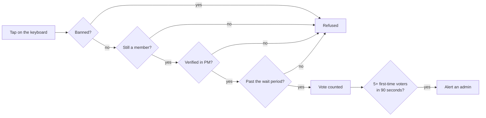

<div align="center">

# 🚪 دربان · Darban

**A gatekeeper for Telegram channels and groups.**
<br>
**دربانی برای کانال‌ها و گروه‌های تلگرام.**

[](https://nextjs.org)
[](https://www.typescriptlang.org)
[](https://www.postgresql.org)
[](https://tailwindcss.com)
[](https://vitest.dev)

**[English](#-english)** · **[فارسی](#-فارسی)**

</div>

---

## 🇬🇧 English

Telegram's own reactions cannot be gated. The setting is all‑or‑nothing, and the bot only hears about a reaction after it has already landed. Darban replaces them: every post carries an inline keyboard, so a tap arrives as a `callback_query` the bot can refuse before it counts.

> **Darban reports, it does not punish.** Brigading is flagged for a human to read. No member is ever removed automatically. Every removal is an admin's own tap, recorded with their Telegram ID.

### ✨ What it does

| | |
|---|---|
| 🗳 **Gated voting** | Three choices under each post (`موافقم` / `مفید بود` / `سؤال دارم`). Counts update live on the keyboard. |
| ⏳ **Wait period** | New members wait before their first vote counts. Default 24 hours, adjustable from 0 to 168. Armed only when the bot witnessed the join, so existing members are never held. |
| ✅ **Account check** | Unverified accounts are sent to press `/start` in the bot's private chat. A low bar on purpose: it costs a real account one tap and costs a throwaway script a session. |
| 🚨 **Brigade alerts** | When five or more accounts that never voted in the chat before land on one post within 90 seconds, an admin gets a private message. Timing and voting history are all it reads. |
| 💬 **Comment gate** | Optionally deletes comments posted from inside the wait window in the linked discussion group. |
| 📋 **Audit trail** | Publish, ban, unban, settings and sync are stored with actor, target, reason and outcome. Uncertain results are marked `UNKNOWN` rather than guessed. |
| 🖥 **Admin panel** | A Persian, RTL dashboard for posts, members, alerts and the operation log. |

### 🔄 How a vote is decided



A refusal answers the tap with the reason and the time remaining. Nothing is deleted, and nothing is held against the account.

### 🧱 Stack

Next.js 16 (App Router) · React 19 · TypeScript · Prisma 7 on PostgreSQL · Tailwind CSS 4 · Zod · Vitest

Admin sessions use the Telegram Login Widget, verified server-side with the bot token and protected against replay. The webhook is authenticated with Telegram's `secret_token` header. Writes are serialized per chat with a Postgres advisory lock, and every Telegram call carries an idempotency key, so a retried request never posts or bans twice.

### 🚀 Getting started

**Requirements:** Node.js 20.9 or newer, a PostgreSQL database, a bot from [@BotFather](https://t.me/BotFather), and an HTTPS URL for the webhook.

```bash
git clone https://github.com/farjadp/Darban.git
cd Darban
npm install
cp .env.example .env     # fill it in, see below
npm run db:deploy        # apply migrations
npm run dev              # http://127.0.0.1:3000
```

Register the webhook once the app is deployed. Without `--apply` the script only inspects and prints the current state:

```bash
npm run guard:setup             # dry run
npm run guard:setup -- --apply  # configure the webhook
```

Then add the bot to your channel as an administrator with permission to post, restrict members, and delete messages, and connect the chat from the panel.

### ⚙️ Configuration

| Variable | Purpose |
|---|---|
| `APP_URL` | Public HTTPS origin. The webhook URL is derived from it. |
| `DATABASE_URL` | PostgreSQL connection string. |
| `GUARD_BOT_TOKEN` | Bot token from BotFather. |
| `GUARD_BOT_USERNAME` | Bot username without `@`. |
| `GUARD_ADMIN_IDS` | Comma-separated Telegram user IDs allowed into the panel. |
| `GUARD_WEBHOOK_SECRET` | 32–256 characters, `A–Z a–z 0–9 _ -`. Sent by Telegram on every update. |
| `AUTH_SESSION_SECRET` | At least 32 bytes. Signs the admin session cookie. |
| `GUARD_TELEGRAM_TIMEOUT_MS` | Telegram request timeout. Default `10000`. |

Panel access needs both: the ID must be listed in `GUARD_ADMIN_IDS` **and** the account must still be an administrator of that chat in Telegram. The second check runs live, so revoking someone in Telegram revokes them here.

### 💬 Bot commands

| Command | Who | Does |
|---|---|---|
| `/start` | anyone | Verifies the account for voting. |
| `/stats <chat_id>` | admin | Members seen, posts, open alerts. |
| `/who <chat_id> <user_id>` | admin | One member's verification, ban and join status. |
| `/ban <chat_id> <user_id> <reason>` | admin | Removes a member. A reason is required. |
| `/unban <chat_id> <user_id> <reason>` | admin | Lifts the ban. Does not bring the member back. |

### 🧪 Development

```bash
npm test         # vitest
npm run typecheck
npm run lint
```

`/preview` renders the dashboard with sample data and no database.

---

<div dir="rtl">

## 🇮🇷 فارسی

واکنش‌های خود تلگرام را نمی‌شود دروازه‌دار کرد. تنظیمش یا همه یا هیچ است و بات تازه وقتی از یک واکنش خبردار می‌شود که ثبت شده باشد. دربان جای آن‌ها را می‌گیرد: زیر هر پست یک کیبورد شیشه‌ای می‌نشیند و هر تپ به‌صورت `callback_query` می‌رسد، یعنی بات می‌تواند پیش از شمرده‌شدن ردش کند.

> **دربان گزارش می‌دهد، مجازات نمی‌کند.** هجوم سازمان‌یافته‌ی رأی فقط برای خواندن یک آدم علامت‌گذاری می‌شود. هیچ عضوی خودکار حذف نمی‌شود. هر حذف، تپ خود مدیر است و با شناسه‌ی تلگرام او ثبت می‌شود.

### ✨ چه می‌کند

| | |
|---|---|
| 🗳 **رأی‌گیری دروازه‌دار** | سه گزینه زیر هر پست: «موافقم»، «مفید بود»، «سؤال دارم». شمارش‌ها همان‌جا روی کیبورد به‌روز می‌شوند. |
| ⏳ **دوره‌ی انتظار** | اولین رأی عضو تازه بعد از یک مهلت شمرده می‌شود. پیش‌فرض ۲۴ ساعت، قابل تنظیم بین ۰ تا ۱۶۸. فقط وقتی فعال می‌شود که بات خودِ لحظه‌ی ورود را دیده باشد، پس اعضای قدیمی هیچ‌وقت معطل نمی‌مانند. |
| ✅ **تأیید حساب** | حساب تأییدنشده به پی‌وی بات فرستاده می‌شود تا `/start` بزند. عمداً سخت‌گیرانه نیست: برای یک آدم واقعی یک تپ است و برای اسکریپت یک‌بارمصرف، یک سشن. |
| 🚨 **هشدار هجوم** | وقتی پنج حساب یا بیشتر که پیش‌تر در آن چت رأی نداده‌اند در بازه‌ی ۹۰ ثانیه روی یک پست جمع شوند، مدیر پیام خصوصی می‌گیرد. تنها چیزی که خوانده می‌شود زمان و سابقه‌ی رأی است. |
| 💬 **دروازه‌ی گفتگو** | در صورت فعال‌بودن، نظرهایی را که از داخل دوره‌ی انتظار در گروه گفتگوی متصل فرستاده شده‌اند حذف می‌کند. |
| 📋 **سوابق عملیات** | انتشار، مسدودسازی، رفع مسدودیت، تنظیمات و همگام‌سازی با عامل، هدف، دلیل و نتیجه ذخیره می‌شوند. نتیجه‌ی نامطمئن به‌جای حدس‌زدن، `UNKNOWN` علامت می‌خورد. |
| 🖥 **پنل مدیریت** | داشبورد فارسی و راست‌چین برای پست‌ها، اعضا، هشدارها و گزارش عملیات. |

### 🔄 مسیر یک رأی

۱. تپ روی کیبورد می‌رسد.
۲. حساب مسدود است؟ رد می‌شود.
۳. هنوز عضو چت است؟ اگر نه، رد می‌شود.
۴. در پی‌وی تأیید شده؟ اگر نه، به پی‌وی راهنمایی می‌شود.
۵. دوره‌ی انتظارش تمام شده؟ اگر نه، مدت باقی‌مانده به او گفته می‌شود.
۶. رأی ثبت و شمارنده به‌روز می‌شود.
۷. اگر پنج رأی‌اولی در ۹۰ ثانیه جمع شده باشند، هشدار برای مدیر می‌رود.

رد شدن یعنی همان تپ با ذکر دلیل و زمان باقی‌مانده جواب داده می‌شود. چیزی حذف نمی‌شود و چیزی به پای حساب نوشته نمی‌شود.

### 🧱 پشته‌ی فنی

‏Next.js 16 (App Router) · React 19 · TypeScript · Prisma 7 روی PostgreSQL · Tailwind CSS 4 · Zod · Vitest

ورود مدیر با ویجت لاگین تلگرام انجام می‌شود، در سمت سرور با توکن بات بررسی و در برابر استفاده‌ی دوباره محافظت می‌شود. وب‌هوک با هدر `secret_token` تلگرام احراز هویت می‌شود. نوشتن‌ها برای هر چت با قفل مشورتی پستگرس پشت سر هم اجرا می‌شوند و هر فراخوانی تلگرام کلید یکتا دارد، پس درخواست تکرارشده دوبار پست یا مسدود نمی‌کند.

### 🚀 راه‌اندازی

**پیش‌نیازها:** ‏Node.js نسخه‌ی ۲۰٫۹ به بالا، یک پایگاه داده‌ی PostgreSQL، یک بات از [@BotFather](https://t.me/BotFather) و یک آدرس HTTPS برای وب‌هوک.

```bash
git clone https://github.com/farjadp/Darban.git
cd Darban
npm install
cp .env.example .env
npm run db:deploy
npm run dev
```

بعد از استقرار، وب‌هوک را یک‌بار ثبت کنید. بدون `--apply` اسکریپت فقط وضعیت فعلی را می‌خواند و چاپ می‌کند:

```bash
npm run guard:setup
npm run guard:setup -- --apply
```

سپس بات را با دسترسی انتشار، محدودکردن اعضا و حذف پیام به کانال اضافه کنید و چت را از پنل وصل کنید.

### ⚙️ پیکربندی

| متغیر | کاربرد |
|---|---|
| `APP_URL` | دامنه‌ی عمومی HTTPS. آدرس وب‌هوک از روی آن ساخته می‌شود. |
| `DATABASE_URL` | رشته‌ی اتصال PostgreSQL. |
| `GUARD_BOT_TOKEN` | توکن بات از BotFather. |
| `GUARD_BOT_USERNAME` | نام کاربری بات، بدون `@`. |
| `GUARD_ADMIN_IDS` | شناسه‌های عددی تلگرام که اجازه‌ی ورود به پنل دارند، با ویرگول لاتین جدا شده. |
| `GUARD_WEBHOOK_SECRET` | بین ۳۲ تا ۲۵۶ نویسه از `A–Z a–z 0–9 _ -`. تلگرام آن را روی هر آپدیت می‌فرستد. |
| `AUTH_SESSION_SECRET` | دست‌کم ۳۲ بایت. کوکی نشست مدیر را امضا می‌کند. |
| `GUARD_TELEGRAM_TIMEOUT_MS` | مهلت درخواست به تلگرام. پیش‌فرض `10000`. |

دسترسی به پنل هر دو شرط را می‌خواهد: شناسه باید در `GUARD_ADMIN_IDS` باشد **و** حساب باید همان لحظه در تلگرام هنوز مدیر آن چت باشد. شرط دوم زنده بررسی می‌شود، پس گرفتن دسترسی کسی در تلگرام، دسترسی‌اش را اینجا هم می‌گیرد.

### 💬 دستورهای بات

| دستور | برای چه کسی | چه می‌کند |
|---|---|---|
| `/start` | همه | حساب را برای رأی دادن تأیید می‌کند. |
| `/stats <chat_id>` | مدیر | اعضای مشاهده‌شده، پست‌ها، هشدارهای باز. |
| `/who <chat_id> <user_id>` | مدیر | وضعیت تأیید، مسدودی و ورود یک عضو. |
| `/ban <chat_id> <user_id> <دلیل>` | مدیر | عضو را حذف می‌کند. ذکر دلیل اجباری است. |
| `/unban <chat_id> <user_id> <دلیل>` | مدیر | مسدودی را برمی‌دارد. عضو را برنمی‌گرداند. |

### 🧪 توسعه

```bash
npm test
npm run typecheck
npm run lint
```

مسیر `/preview` داشبورد را با داده‌ی نمونه و بدون پایگاه داده نشان می‌دهد.

</div>
